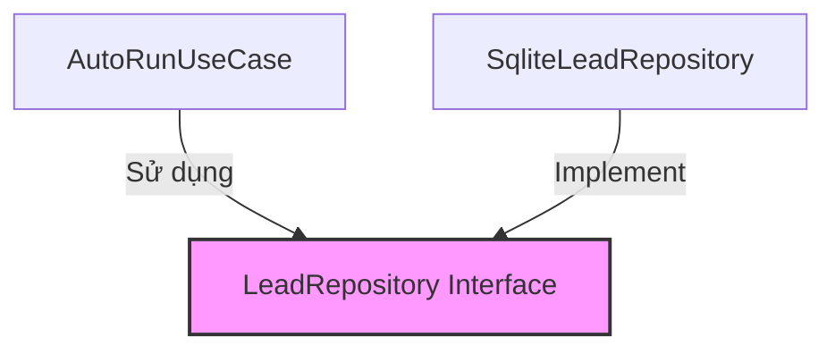

# 🏛️ ARCHITECTURE DOCUMENTATION — LEADHUNTER PROJECT

**Dự án:** LeadHunter  
**Kiến trúc mẫu:** Clean Architecture & Domain-Driven Design (DDD)  
**Ngày cập nhật:** 2026-08-11  

---

## 📐 1. KIẾN TRÚC TỔNG QUAN (CLEAN ARCHITECTURE)

Hệ thống **LeadHunter** tuân thủ nghiêm ngặt nguyên tắc **Clean Architecture** với hướng phụ thuộc một chiều (Single Direction Dependency Rule):

```text
Presentation Layer (GUI / CLI)
          │
          ▼
Application Layer (Use Cases & Ports)
          │
          ▼
Domain Layer (Entities, Value Objects, Services)
          ▲
          │ (Dependency Inversion)
Infrastructure Layer (SQLite, Playwright Scraper, Excel Writer)
```

---

## 🧱 2. PHÂN TÍCH THEO CÁC TẦNG (LAYERS)

### 2.1. Presentation Layer (`leadhunter/presentation` & `gui_app.py`)
- **Nhiệm vụ:** Tiếp nhận tương tác người dùng từ Giao diện GUI Desktop (PyWebView) hoặc Giao diện dòng lệnh (Click CLI).
- **Quy tắc:**
  - Không chứa câu lệnh SQL trực tiếp.
  - Không chứa business rules hoặc logic lọc dữ liệu.
  - Gọi Use Cases của Application Layer để xử lý dữ liệu.
  - Chuyển đổi DTOs thành giao diện hiển thị cho người dùng.

### 2.2. Application Layer (`leadhunter/application`)
- **Nhiệm vụ:** Điều phối luồng công việc (Orchestration), quản lý chiến dịch cào dữ liệu (`AutoRunUseCase`), xuất báo cáo (`ExportLeadsToExcelUseCase`).
- **Thành phần:**
  - **Use Cases:** `auto_run_use_case.py`, `export_leads_to_excel.py`, `import_leads_from_file.py`, `score_leads.py`...
  - **Ports (Interfaces):** `LeadRepository`, `IngestionSourceAdapter` định nghĩa các giao ước giao tiếp ra hạ tầng bên ngoài.

### 2.3. Domain Layer (`leadhunter/domain`)
- **Nhiệm vụ:** Chứa đựng toàn bộ quy tắc nghiệp vụ cốt lõi (Business Rules) độc lập 100% với khung phần mềm bên ngoài (Framework Agnostic).
- **Thành phần:**
  - **Entities:** `Lead`, `LeadStatus`.
  - **Value Objects:** `PhoneNumber`, `CompanyName`, `Email`, `Website`.
  - **Domain Services:** `telecom_service.py` (kiểm tra nhà mạng), `normalization_service.py` (chuẩn hóa chuỗi), `scoring_service.py`, `dedup_service.py`.
- **Đặc tính:** Không `import sqlite3`, không `import playwright`, không phụ thuộc vào hệ thống tập tin hay GUI.

### 2.4. Infrastructure Layer (`leadhunter/infrastructure`)
- **Nhiệm vụ:** Hiện thực hóa (Implement) các Port Interfaces của Application Layer bằng công nghệ cụ thể.
- **Thành phần:**
  - **Persistence:** `SqliteLeadRepository`, `ConnectionManager`, `MigrationRunner`.
  - **Adapters:** `GoogleMapsScraper` (Playwright Chromium), `ExcelWriterAdapter` (OpenPyXL), `ExcelReaderAdapter`.
  - **Config & Logging:** `ConfigLoader`, `JsonFormatter`.

---

## 🔄 3. NGUYÊN TẮC PHỤ THUỘC (DEPENDENCY INVERSION PRINCIPLE)

Domain Layer không bao giờ phụ thuộc vào Infrastructure Layer. Ngược lại, Infrastructure Layer implements các interface do Application/Domain định nghĩa:


