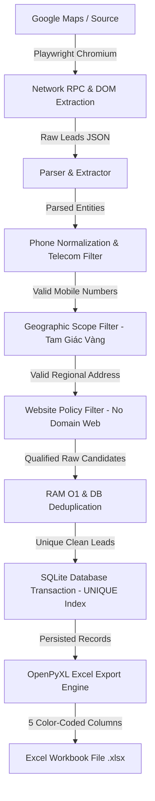

# 🔄 DATA FLOW DOCUMENTATION — LEADHUNTER PIPELINE

**Dự án:** LeadHunter  
**Mô tả:** Luồng di chuyển và xử lý dữ liệu qua từng giai đoạn của pipeline

---

## 🌊 1. TỔNG QUAN LUỒNG DỮ LIỆU (DATA PIPELINE MAP)

Dữ liệu được thu thập và xử lý qua 7 giai đoạn liên tục theo mô hình Pipeline:

---

## 📊 2. CHI TIẾT TỪNG GIAI ĐOẠN XỬ LÝ (STAGE BREAKDOWN)

### Giai đoạn 1: Network RPC & DOM Extraction
- **Đầu vào:** Keyword tìm kiếm (ví dụ: `"nội thất" Biên Hòa`).
- **Xử lý:** Khởi tạo Playwright Chromium headless/headful với xoay vòng User-Agent ngẫu nhiên (Linux, Mac, Windows).
- **Cơ chế kép:** Ưu tiên bóc tách gói tin RPC ngầm dạng JSON; tự động fallback về cuộn danh sách và cào thẻ DOM nếu JSON bị chặn.
- **Đầu ra:** Danh sách dictionary chứa dữ liệu thô `[{"name": "...", "phone": "...", "address": "...", "website": "..."}]`.

### Giai đoạn 2: Parser & Extractor
- **Đầu vào:** Dictionary dữ liệu thô.
- **Xử lý:** Lọc loại bỏ tên nút giao diện rác (UI junk buttons như `"directions"`, `"see nearby"`). Loại bỏ Place ID ngầm.
- **Đầu ra:** Data Object chứa tên công ty và số điện thoại thô.

### Giai đoạn 3: Phone Normalization & Telecom Filter
- **Đầu vào:** Chuỗi SĐT thô (`"+84 90 123 4567"`, `"028.3910.5678"`, `"1900 1560"`).
- **Xử lý:** 
  1. Loại bỏ ký tự đặc biệt, chuẩn hóa về chuẩn di động 10 chữ số (`0901234567`).
  2. Lọc bỏ số máy bàn tổng đài `024`, `028`, `1900`, `1800`.
  3. Lọc nhà mạng Viettel/Vina/Mobi dựa trên cài đặt của chiến dịch (`allow_viettel`, `allow_vina`, `allow_mobi`).
- **Đầu ra:** Value Object `PhoneNumber` hợp lệ.

### Giai đoạn 4: Geographic Scope Filter
- **Đầu vào:** Địa chỉ chuỗi thô.
- **Xử lý:** Kiểm tra đối chiếu với danh sách địa danh hợp lệ thuộc Tam Giác Vàng: TP.HCM, Bình Dương, Đồng Nai và các quận/huyện/thành phố trực thuộc. Loại bỏ tỉnh thành ngoài phạm vi (Hà Nội, Cần Thơ, Long An...) và chuỗi chung chung (`"Việt Nam"`).
- **Đầu ra:** Dữ liệu địa chỉ đạt tiêu chuẩn khu vực.

### Giai đoạn 5: Website Policy Filter
- **Đầu vào:** URL website thô.
- **Xử lý:** 
  - Nếu `allow_web=False` (mặc định): Lọc bỏ các trang có tên miền riêng (`abc.com`, `xyz.vn`). Giữ lại các đường dẫn mạng xã hội (Facebook, Zalo, Shopee) hoặc trống.
  - Nếu `allow_web=True`: Giữ lại toàn bộ.

### Giai đoạn 6: RAM & DB Deduplication
- **Đầu vào:** Candidate lead đã qua lọc.
- **Xử lý:** 
  1. Tra cứu tập hợp RAM `batch_phones` thời gian thực `O(1)`.
  2. Bắt ngoại lệ `sqlite3.IntegrityError` tại tầng CSDL nhờ `CREATE UNIQUE INDEX idx_leads_phone_unique`.
- **Đầu ra:** Lead duy nhất không bị trùng lặp.

### Giai đoạn 7: SQLite Persistence & Excel Export
- **Đầu vào:** Thể hiện `Lead` hợp lệ.
- **Xử lý:** Ghi bản ghi vào CSDL SQLite thông qua giao dịch an toàn (Transaction), sau đó gọi `ExcelWriterAdapter` xuất file Excel 5 cột màu sắc nhận diện nổi bật (`Công ty`, `Điện thoại`, `Địa chỉ`, `Website`, `Nguồn`).
- **Đầu ra:** Tập tin Excel kết quả.
